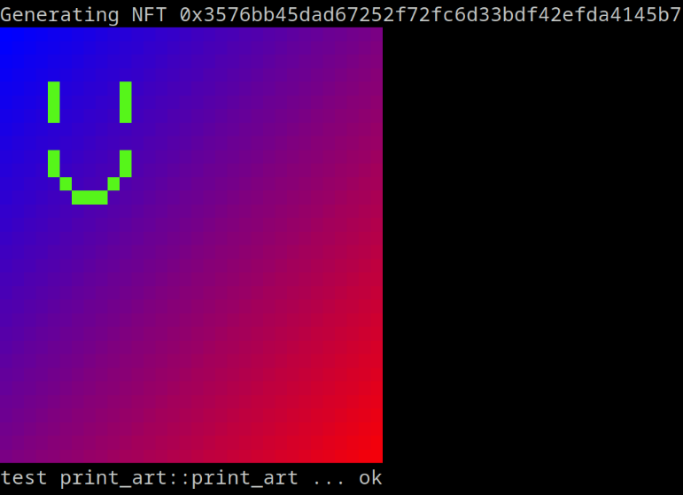

# ETHGlobal NFT Workshop

This repo provides an example ERC-721 generative art project. Included are methods for designing, debugging, and viewing NFTs using the Rust programming language.

Though this code has **not** been audited, these NFTs may be listed on platforms on OpenSea, and are entirely on-chain since they use procedural generation. This is made possible by the [Stylus SDK][SDK], which provides a Solidity-equivalent experience when writing Rust smart contracts.

## Getting started

In order to build and deploy your NFT, we'll need a few things.

### [Rust][rust]

The compiler, along with the build tool `cargo` can be installed [here][rust].

Note that you may need to update your Rust version and add the `wasm32` target.

```sh
rustup upgrade
rustup target add wasm32-unknown-unknown
```

### The [Stylus CLI Tool][cli]

The following installs `cargo stylus`, the standard tool for deploying Stylus contracts.

```sh
cargo install --force cargo-stylus
```

### [Stylus Testnet Ether][eth]

You'll need testnet eth to pay for gas, which you can get from [this faucet][eth].

Note that you may need to add the Stylus testnet to your wallet.

| Name           | RPC                                    | Chain ID | Symbol | Block explorer                               | Parent chain     |   |
|:---------------|:---------------------------------------|:---------|:-------|:---------------------------------------------|:-----------------|---|
| Stylus testnet | https://stylus-testnet.arbitrum.io/rpc | 23011913 | ETH    | https://stylus-testnet-explorer.arbitrum.io/ | Arbitrum Sepolia |   |

For more information on wallets and testnet ether, please refer to the [Stylus Quickstart][quick].

## Create your NFT

We'll want to clone this repo to start building.

```sh
git clone https://github.com/OffchainLabs/stylus-workshop-nft.git
cd stylus-workshop-nft
```

You'll notice the following source files in the `src/` directory. Each has a purpose, and relevent documentation within each file.

| File                               | Info                                       |
|:-----------------------------------|:-------------------------------------------|
| [`erc721.rs`][erc721.rs]           | Implements the [ERC-721 standard][erc721]. |
| [`main.rs`](src/main.rs)           | Defines the entrypoint.                    |
| [`utils.rs`](src/utils.rs)         | Utilities for generating onchain pngs.     |
| [`print_art.rs`](src/print_art.rs) | Prints your NFT to the console 👀          |
| [`art.rs`][art.rs]                 | **Where to draw your NFT 😄**              |

For today's workshop, two files are of interest: [`erc721`][erc721.rs], which provides an implementation of the [ERC-721 standard][erc721], and [`art`][art.rs], where'll you can draw your NFT!

If your a Solidity expert and familiar with the 721 standard, you may find [erc721][erc721.rs] particularly educational. Included are all the methods, which work exactly as you'd expect in Solidity. They're even callable by other contracts written in other languages, since the Stylus SDK uses the Solidity ABI!

It's time to make some art though, so we'll turn our focus to [`art.rs`][art.rs]. There you'll see a method named `generate_nft` at the bottom.

```rs
pub fn generate_nft(address: Address, token_id: U256) -> Image<32, 32> {
    let mut hasher = FnvHasher::new();
    hasher.update(token_id.as_le_slice());
    hasher.update(address.as_slice());
    let mut rng = Rng::with_seed(hasher.output());

    let bg_color = Color::from_hex(0xe3066e);
    let fg_color = Color {
        red: rng.u8(..),
        green: rng.u8(..),
        blue: rng.u8(..),
    };

    let mut image = Image::new(bg_color);

    image.draw_gradient(Color::from_hex(0xff0000), Color::from_hex(0x0000ff));
    image.draw_line(Cell::new(4, 4), Cell::new(4, 6), fg_color);
    image.draw_line(Cell::new(10, 4), Cell::new(10, 6), fg_color);
    image.draw_ellipse(Cell::new(7, 9), 3, 3, [false, false, true, true], fg_color);
    image
}
```

The above takes in a sequential `token_id`, which you can use to seed your NFT, and builds an image via the various draw methods like `draw_line` and `draw_elipse`.

You can modify the above in various ways.

- Change or add call methods to draw different shapes.
- The return result is a 32x32 grid. You can change the dimensions by editing the `-> Image<32, 32>` part.
- The `token_id` is unique to each NFT. You should condition what you draw based on it.

In Stylus, execution is 10-100x cheaper. The drawing methods can do large amounts of work with negligible fees. As a consequence, Stylus NFTs can be highly generative and entirely onchain. In fact, the contract in this repo can even produce PNGs and terminal images on the fly without having to include any offchain data. Try it out!

```sh
cargo test print_art -- --nocapture
```



## Deploy your NFT

You can check the readiness of your NFT as follows.

```sh
cargo stylus check --nightly
```

If everything checks out, you're ready to deploy!

```sh
cargo stylus deploy --nightly --private-key 0x<your private key>
```

Note that it's generally better to use `--private-key-path` for security reasons.

See `cargo stylus deploy --help` for more information.

[SDK]: https://github.com/OffchainLabs/stylus-sdk-rs
[eth]: https://bwarelabs.com/faucets/arbitrum-stylus-testnet
[rust]: https://www.rust-lang.org/tools/install
[cli]: https://github.com/OffchainLabs/cargo-stylus
[quick]: https://docs.arbitrum.io/stylus/stylus-quickstart
[erc721]: https://eips.ethereum.org/EIPS/eip-721

[art.rs]: src/art.rs
[erc721.rs]: src/erc721.rs
